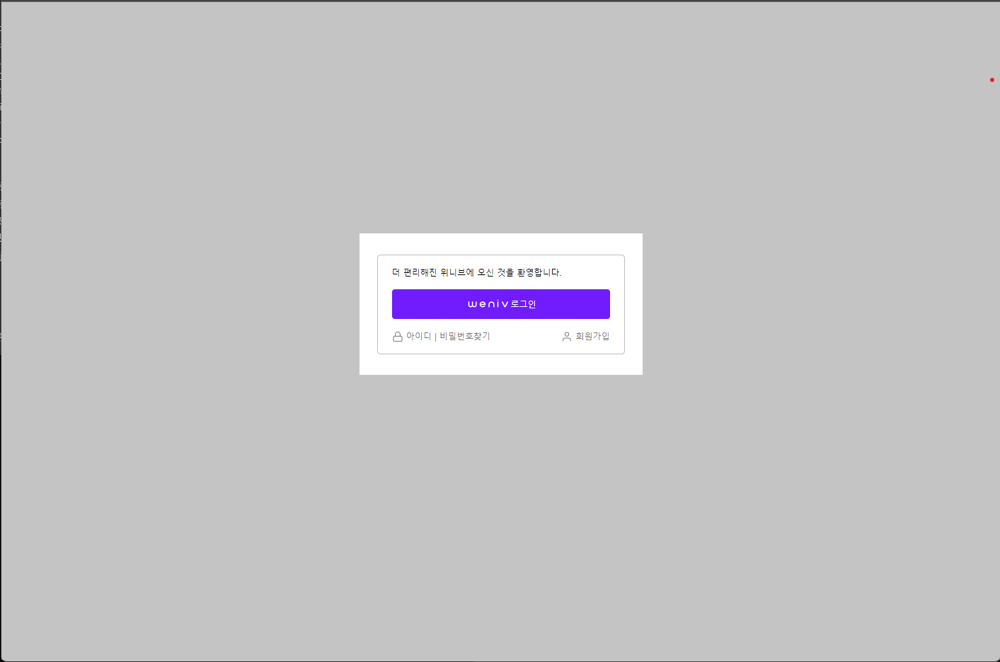

# 로그인화면 구현하기

- ## 구현 화면

<div align="center">

</div>

- ## 사이트 주소

  https://yoojs1205.github.io/loginform_excercise/

- ## 사용한 기술 스택

  </a>&nbsp;
  </a>&nbsp;

- ## 개발 이슈
  1. 로그인화면 중앙정렬<br><br>
     ```css
     .log-in {
       background-color: #ffffff;
       /* 중앙 정렬 */
       position: absolute;
       left: 50%;
       top: 35%;
       transform: translate(-50%);
       padding: 30px 25px;
       width: 400px;
       height: 200px;
       box-sizing: border-box;
     }
     ```
     => `left: 50%` / `top: 50%` 으로 중앙정렬을 하려했으나, 너무 밑에 배치가되어 `top: 35%` 를 하였을 때 얼추 수직정렬이 되었다. 해결해야할 문제이다.
